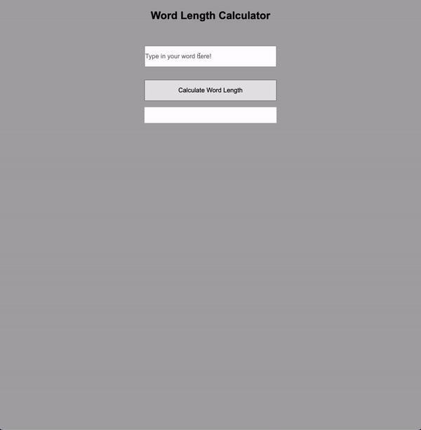

### Word Character Count

> Create random number in a given range.

## Live Demo

Preview: https://pirci.github.io/word-count/

## What I Learned:

- Practice **getElementById** with project.
- Using **addEventListener** method.
- Inner HTML **DOM** manipulation.
- Basic HTML and CSS structure & style.

## Possible Improvements

> Any type of suggestions/improvements to this repo are always welcome.
